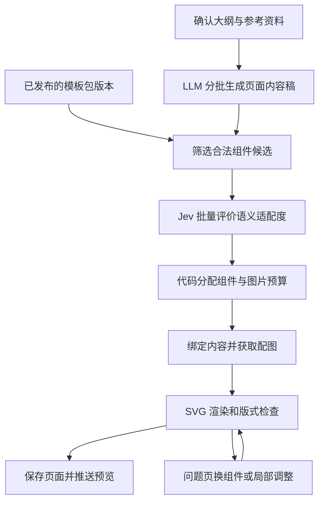

# 群笔记：可复用模板包 ＋ 结构化内容生成 ＋ Jev 组件匹配（快速生成模式）

- 状态：**仓库链路已接入；Jev 多样性、并发与异常恢复修复已验证（2026-09-24）**。当前实现与限制以 [模板包模块说明](src/landppt/services/template_package/README.md) 为准；真实模型效果与性能收益未实测。
- 主笔：codex-astra-high
- 补充：claude-opus-5
- 命题与约束：about
- 整理落盘：dsv4.1-flash ｜ 2026-09-20
- 首批实现：codex-astra-high ｜ 2026-09-22；实现范围见 [模板包模块说明](src/landppt/services/template_package/README.md)。已具备冻结的内容稿/包契约、来源引用校验、8 类内置 SVG 版式（10 个组件）、候选硬约束筛选、XML 绑定、受控图片引用与排版失败检查。
- 验证：`uv run --extra dev pytest tests/test_template_package.py tests/test_svg_page_pipeline.py -q` 为 75 passed；10 页 Chromium 预览已检查；Black、isort（black profile）、flake8 检查通过。正式 tests 全量运行出现 43 项失败，排除新增测试后复跑仍为相同的 43 项失败（包括硬编码 Linux 路径、缺失素材、旧接口/提示词断言）。
- 可运行样例：`uv run python scripts/template_package_preview.py`，产物位于 `artifacts/template-package/`。报告只统计本地绑定排版时间，不能代表端到端提速。
- 当前完成边界：数据库、模板包版本/API、内容扩充、Jev、素材、SSE/续跑/计费、内容编辑和 AI 创建模板包已接入。2026-09-24 定向回归 100 passed，包含并发失败、取消和真实 SQLite 写锁竞争；浏览器配置保存与回读（并发 16）及入口 smoke 通过。PostgreSQL 实机、用户现场中断和真实模型效果尚未复测。历史设计与首批验证记录保留如下，具体代码决策见仓库说明。

---

## 0. 这份笔记要回答什么

about 提出的原始命题：让大模型先生成整套 PPT 所需的前端组件与设计模板，再由 Jev 选择、组合每一页，实现“生成式 UI”，是否比现有逐页生成更快。

讨论收敛出的结论：

1. **方向成立，但提速来源要说清楚。** 快的是“代码确定性渲染替代逐页写完整 HTML/SVG”；Jev 不是提速点，它是让这条路可控的判别器。只要每页仍由大模型输出完整页面代码，组件包只是多了一步。
2. **组件应作为可复用的全局模板包沉淀**，在设计阶段生成并验证一次、之后反复复用，而不是每份 PPT 重新生成。这一条同时缓解“整套组件生成完成才能继续”带来的首屏等待。
3. **大纲到最终页面之间存在大模型的内容扩充，这一步必须保留。** 做法是把它从“页面代码生成”里拆出来，成为独立、可编辑、可缓存的结构化**页面内容稿**；Jev 依据扩充后的内容稿选组件，而不是直接依据大纲选。

一个来自官方文档的数据点，仅作参考：同一请求内合并多问的批量判断实验，相比逐问请求约快 10 倍、便宜 12.2 倍（<https://docs.typesafe.ai/cookbooks/parallel_questions>）。这是同一文档的判断实验，**不能换算成 PPT 生成快 10 倍**。

---

## 1. 产品范围与最终使用流程

在现有“全局模板”中增加**模板包**类型。

用户流程：

1. 生成并确认大纲。
2. 选择一个模板包，查看整套样例和包含的版式。
3. 系统扩充生成页面内容稿。
4. 自动选择组件、获取配图并生成页面。
5. 用户可以改文字、换版式、换图片，或单页切换为自由设计。
6. 沿用现有预览、放映和导出入口。

模板包支持两种来源：

- 内置、人工验证过的模板包；
- LLM 根据主题、风格要求生成的新模板包，验证后保存复用。

第一版先交付**内置模板包的完整生成链路**；后续阶段补齐 AI 创建模板包，最终覆盖前面讨论的生成式 UI 方案。

---

## 2. 整体架构



三个概念必须分开，不能混用一个字段：

| 字段 | 含义 | 建议值 |
|---|---|---|
| `template_kind` | 模板资源类型 | `single`、`package` |
| `generation_mode` | 页面生成方式 | `freeform`、`package` |
| `render_mode` | 页面渲染格式 | 沿用 `html`、`svg` |

模板包第一版使用 SVG。以后增加 HTML 模板包时，不需要重新定义生成方式。

当前 SVG 自由生成只借助 HTML 母版提炼设计风格；模板包需要新增“选组件并直接渲染”的分支，**不能直接沿用该路径**。

---

## 3. 模板包规范

一个模板包包含统一主题和若干**完整页面组件**。第一版以完整页面组件为单位，控制自由拼装带来的复杂度。

| 内容 | 必需信息 |
|---|---|
| 基本信息 | 名称、描述、封面、标签、语言、画布比例 |
| 版本信息 | 契约版本、包版本、内容哈希 |
| 主题 | 配色、字体、字号层级、间距、图标风格 |
| 组件 | 唯一 ID、版式家族、SVG 源码 |
| 内容契约 | 接受哪些字段、字段类型、必填项、列表容量 |
| 槽位定义 | SVG 节点、内容字段映射、图片比例、文字框尺寸 |
| 适用描述 | 适合的页面目的、信息关系、不适用情况 |
| 示例 | 样例内容、预览、边界容量用例 |

建议首个模板包包含八个组件：

- 封面
- 章节过渡
- 三要点说明
- 双栏对比
- 三至五阶段流程
- 单图说明
- 指标展示
- 总结与行动建议

同一组件允许少量明确变体，例如三项/四项、图左/图右、短文/长文，每个变体声明自己的容量和配图槽位。

**绑定方式必须确定且可验证。** 例如用 SVG 节点 ID 对应 `title`、`blocks[0].body` 等字段；文字通过 XML 节点赋值，图片通过受控素材引用绑定。模板包**不携带任意可执行脚本**。

组件还应声明字段类型、文字容量、图片比例和允许的变体。代码先筛掉不满足约束的候选，Jev 再根据语义选择。给 Jev 的主要是**用途和约束描述**，无需把整套前端源码塞进去。

---

## 4. 页面内容稿：保留现有扩充能力

新增独立的内容生成阶段，把现在隐含在页面生成中的写作过程显式化——当前逐页生成把“内容表达、设计、完整 HTML/SVG 输出”放在同一次调用里。

输入：

- 已确认大纲和用户要求；
- 受众、语言、表达风格；
- 相关参考资料及来源标识；
- 全篇内容摘要；
- 模板包支持的内容类型和容量范围。

输出是**可直接展示的结构化成稿**，主要字段：

| 字段 | 用途 |
|---|---|
| `slide_id` | 稳定关联页面，重排后仍可追踪 |
| `title`、`subtitle` | 最终展示标题 |
| `intent`、`relation` | 页面目的与信息关系 |
| `blocks` | 带稳定 ID 的正文、步骤、对比项 |
| `metrics`、`chart_data` | 有来源的数据与单位 |
| `takeaway` | 核心结论 |
| `source_refs` | 内容与资料的关联 |
| `visual_briefs` | 配图主题、用途和素材要求 |
| `content_revision` | 内容版本 |

示例（大纲「落地路径：试点、验证、推广」的扩充结果）：

```json
{
  "slide_id": "s08",
  "title": "先验证效果，再扩大应用范围",
  "relation": "sequence",
  "blocks": [
    { "id": "b1", "heading": "小范围试点", "body": "选择边界清晰的场景，明确负责人和验收标准。" },
    { "id": "b2", "heading": "验证与调整", "body": "结合实际反馈检查效果，完善流程与使用方式。" },
    { "id": "b3", "heading": "逐步推广", "body": "将验证过的方法沉淀为规范，分阶段扩大应用。" }
  ],
  "takeaway": "每个阶段都应有明确的进入条件和验收结果。"
}
```

采用有类型的内容块，覆盖正文、列表、步骤、对比、指标等形态，**避免全部退化成相同的卡片列表**。

分批策略：初始按每批约 3～5 页生成，实际以输出 token 预算调整，限制并发；每批共享全篇大纲和术语约定，仅附带相关资料。第一批完成后即可进入匹配和渲染，后续批次继续生成。

生成后校验：

- 页数、页面 ID 和必需字段完整；
- 大纲要求有对应内容，避免遗漏与跨页重复；
- 数据、单位和引用一致；
- 不为满足组件数量编造事实；
- 部分页面失败时，仅重试失败页。

内容稿按版本保存，模板切换可以复用；材料或大纲变化时，只将受影响页面标为需要更新。

---

## 5. Jev 的职责和接入方式

新增独立的决策服务，使用项目已有的 `httpx` 异步调用能力访问 TypeSafe，**无需强行接入面向文本生成的 `AIProvider`**。

第一版采用**页面内容 × 合法候选组件的适配矩阵**，而不是逐页单选。理由：同一请求里的问题各自独立求解、互相不可见（<https://docs.typesafe.ai/cookbooks/parallel_questions>），全篇约束只能由代码处理；而“布局是什么”“图片几张”“组件是什么”分开问可能得到互相冲突的结果。

做法：每页做一次 `choice`、或按“页面内容 × 候选组件”做 `noul` 打分，一次请求返回整张兼容矩阵（例如 15 页 × 8 个组件），再由代码在矩阵上做分配。

先由代码排除：

- 缺少必需内容字段的组件；
- 项目禁止配图，但组件必须使用图片的方案；
- 内容项目数不符合契约的组件；
- 容量明显不足的组件；
- 与用户手动锁定设置冲突的方案。

再让 Jev 对剩余候选判断，例如：

> `slides.s08` 的内容关系和表达目的，是否适合 `components.timeline_3` 所描述的呈现方式？

采用 `noul`，得到适配判断值。**每个问题必须明确引用页面和组件，不能只依赖问题键名**——键名不参与推理（<https://docs.typesafe.ai/api>）。

注意：

- `noul` 没有独立的 `confidence` 字段；
- 各项结果不要求相加为 1；
- 高适配值不能证明最终视觉质量；
- “不适合”的阈值必须用中文实际样本校准，不提前认定某个数字普遍有效。

一次请求批量处理多个匹配问题，但按上下文预算切分，避免把全部源码、资料和页面无差别塞进 `state`。

配置包含：启用开关、API Key、模型版本、超时、并发和重试上限。记录实际响应模型版本及 token 用量；生产评测后固定版本，避免模型别名更新影响既有阈值。**模板包与 Jev 解耦**：包负责描述组件和约束，选择器可用 Jev、现有模型或用户手动指定；没有配置 Jev 时，模板包仍然能使用。

---

## 6. 全篇组件分配与配图规划

分配器把 Jev 的适配结果当作一种排序依据，同时考虑全篇要求。

硬约束：

- 用户锁定的页面和版式；
- 必需内容完整保留；
- 合法组件和可用素材来源；
- 图片预算及数量上限；
- 已确认页数。

软偏好：

- 相邻页面减少重复版式；
- 内容密度与组件容量匹配；
- 降低不必要的配图成本；
- 保持章节间视觉变化。

第一版使用有界搜索或束搜索即可，暂不引入复杂求解器。**软偏好不能迫使系统选择不适合内容的组件**；允许必要的版式重复。

**首屏速度和全篇最优存在取舍。** 默认按内容批次逐步分配，保留已展示页面的选择，携带剩余图片预算和上一页版式继续处理；整套完成后不自动重排用户已看到的页面；可以提供显式的“重新优化全篇版式”。

配图数量从所选组件的槽位需求推导。现有 `PPTImageProcessor` 增加“接受已确定图片计划”的入口，复用搜索、生图和下载能力，跳过旧的需求分析，避免重复调用和互相覆盖。素材获取失败时，按既定来源策略重试或切换合法组件；无法完成的页面保留待处理状态。

---

## 7. 渲染、局部修复与回退

复用现有 `svg_page` 下的清洗、文字排版、几何检查和 HTML 壳能力，新增组件实例化与字段绑定。选择 SVG 作为组件载体、而不是另起 HTML 组件体系的原因：项目里已有槽位几何、文本测量、自动换行、溢出度量和符号库，组件就是**带命名槽位的 SVG 壳**，内容绑定后可在代码里直接量出是否溢出，很多“能不能装下”的判断根本不用问 Jev。

渲染顺序：

1. 实例化指定包版本和组件变体；
2. 绑定内容及素材；
3. 应用主题、页码和图片裁切；
4. 进行文字排版与版式检查；
5. 包装成现有 HTML 壳；
6. 保存到 `SlideData.html_content`。

组件已验证不代表所有内容都能装下，运行时仍需检查。问题处理顺序：

1. 代码自动换行和允许范围内的排版调整；
2. 更换同包中的容量变体或其他合适组件；
3. 只精简超长字段，生成新的内容版本并复检；
4. 回退到现有自由 SVG 生成；
5. 仍失败则显示待处理，**不把占位页当作成功完成**。

配置明确的修复次数上限。固定页数时不自动拆页；不通过截断正文或过度缩字掩盖溢出。预览和导出继续消费现有 `html_content`，但需实际验证 PDF、PPTX 和视频链路，尤其检查字体、裁图及 SVG 在 PPTX 中的呈现和可编辑性。

---

## 8. 数据存储与版本设计

| 对象 | 改动 |
|---|---|
| `GlobalMasterTemplate` | 新增 `template_kind`，默认 `single` |
| 模板包版本表 | 保存包 ID、版本、状态、manifest、哈希、预览和资源引用 |
| 页面内容稿表 | 保存项目、页面 ID、内容版本、内容 JSON、输入指纹及状态 |
| `Project.project_metadata` | 保存生成模式、选定包版本和生成配置 |
| `SlideData.slide_metadata` | 保存内容版本引用、组件 ID、绑定关系、素材、修复报告及编辑状态 |

注意：当前 `SlideData.template_id` 指向 `ppt_templates`，**不能直接用它存全局模板包 ID**。

模板包生命周期：

```text
草稿 → 验证 → 可用版本 → 停用
```

已发布版本不可原地修改。修改时产生新版本；**项目固定引用包版本**，已有项目不会随全局模板包更新而变化；被项目引用的版本保留资源，停用仅阻止新项目选择。

原有 `html_template` 非空约束第一阶段可保留，模板包记录使用空串作为兼容存储值，由类型化接口校验真正内容；所有 HTML 专用预览和生成逻辑按 `template_kind` 分流。旧请求不传类型时仍按普通模板处理。数据库变更走现有迁移机制，并同时验证 SQLite 与 PostgreSQL。

---

## 9. 流水线、编辑器与异常恢复

模板包分支**必须早于当前 SVG 自由生成分支**，否则会继续进入逐页模型绘制。

新增以下内部阶段，并映射到现有 SSE 进度展示：

```text
内容生成 → 组件匹配 → 素材准备 → 页面渲染 → 检查修复
```

每页保存阶段结果。重复请求、取消后重试、进程重启，应复用有效结果；禁止旧任务覆盖用户的新修改。

编辑操作要明确区分：

| 操作 | 行为 |
|---|---|
| 修改文字 | 更新内容稿，重新绑定和检查当前页 |
| 更换版式 | 复用内容与素材，不重新扩写整页 |
| 更换图片 | 更新对应槽位 |
| 自然语言修改内容 | LLM 返回结构化内容补丁 |
| 任意修改 SVG/页面源码 | 标为手动自由页，退出自动组件重渲染 |
| 恢复模板包控制 | 显式执行，并保留原页面版本 |

内容稿是模板包页面的文本来源。内容变化后，讲稿、配音和视频标为过期；仅换版式时，可保留讲稿与音频，但重新生成受视觉影响的视频。

缓存键包含用户范围、内容哈希、模板包版本、模型版本、提示词版本和约束配置；用户私有内容不进入跨用户共享缓存。扣费沿用现有用户可见操作规则，内部内容扩写、Jev 判断和修复单独记录成本；断线重试不能重复扣同一笔页面生成费用。

---

## 10. API、界面和代码改动

复用 `/api/global-master-templates`，扩展列表过滤、创建、详情、复制和选择逻辑，新增模板包版本能力。

拟议接口：

| 功能 | 接口形态 |
|---|---|
| 创建版本草稿 | `POST /api/global-master-templates/{id}/versions` |
| 校验与生成预览 | `POST .../{id}/versions/{version}/validate` |
| 发布可用版本 | `POST .../{id}/versions/{version}/publish` |
| AI 生成模板包 | 独立生成任务，复用现有流式任务机制 |
| 查看和修改内容稿 | 项目页面下的 `content` 接口 |
| 查看可用版式 | 项目页面下的 `layout-candidates` 接口 |
| 应用版式 | 项目页面下的 `layout` 接口 |

内容更新携带版本号，冲突时拒绝覆盖；所有接口继承现有用户与项目权限检查。

建议新增模块：

```text
services/template_package/
    schemas.py
    service.py
    validator.py
    generator.py

services/slide/package_generation/
    content_service.py
    candidate_filter.py
    selector.py
    allocator.py
    renderer.py
    workflow.py

services/evaluation/
    typesafe_client.py
```

主要现有改动位置：

- `database/models.py`、迁移和仓储层；
- `api/models.py`、`api/global_master_template_api.py`；
- `services/template/global_master_template_service.py`；
- 模板选择、页面生成和流式任务入口；
- `ppt_image_processor.py`；
- 全局模板管理页、模板选择页、幻灯片编辑器。

仓库有两个同名全局模板服务文件；当前 API 引用的是 `services/template/` 下的版本。实施时先核对调用关系，避免双份实现发生偏差。

界面上展示“模板包”“包含版式”“内容编写中”“页面排版中”等用户信息；Jev 模型配置和诊断详情放在设置及日志中。

---

## 11. AI 创建模板包（第二阶段）

建立在可用的包规范与渲染器之上。

1. 用户指定用途、风格、语言和需要覆盖的页面类型；
2. LLM 先生成主题与组件清单；
3. 按组件生成 SVG、槽位契约和示例内容；
4. 校验 ID、字段映射、容量和 SVG 合法性；
5. 使用短文本、长文本、中文、列表边界等样例渲染；
6. 定点修复失败组件；
7. 生成整包预览，保存可复用版本。

只有通过验证的组件进入可用包；未完成的包保留为草稿。组件包创作成本单独统计，复用时无需再次承担这部分生成开销。

---

## 12. 实施顺序与每阶段交付

| 阶段 | 开发内容 | 完成标准 |
|---|---|---|
| A：基线与契约 | 记录现有耗时，确定内容稿和包规范 | 数据结构、样例和基准集稳定 |
| B：模板包基础 | 数据迁移、版本管理、内置包、绑定渲染 | 手动选组件即可生成、编辑、导出 |
| C：内容生成 | 分批扩写、保存版本、局部重试 | 保留现有内容扩充能力 |
| D：Jev 自动匹配 | 客户端、候选筛选、矩阵与分配器 | 自动完成模板包 PPT |
| E：产品整合 | 配图、SSE、续跑、编辑保护、计费、无人值守 | 用户流程完整，异常可恢复 |
| F：AI 创建包 | 组件生成、验证、预览、保存复用 | 用户可创建并复用新模板包 |
| G：评测与开放 | 对照实验、调参、灰度开关 | 达到性能与质量门槛 |

阶段 E 已形成完整的快速生成产品；阶段 F 补齐动态模板包创作。第一版建议范围：**全局模板新增模板包类型，一个包内提供 6～8 个经过验证的 SVG 页面组件，支持自动匹配和手动换版式**，先验证复用与直接渲染效果，再开放“大模型生成新模板包并保存复用”。

---

## 13. 测试与验收

功能回归重点：

- 普通模板和现有 HTML/SVG 自由生成仍可运行；
- 模板包版本不可变、跨用户权限隔离；
- 内容稿字段完整，失败仅重试受影响页面；
- 槽位绑定、字符转义、图片引用及素材失效处理；
- Jev 超时、429/529、缺失答案、非法数值、部分批次失败；
- 图片预算、锁定页、容量约束及无合适候选；
- 取消、重启续跑、并发编辑和重复扣费；
- 手动页面不会被自动重渲染覆盖；
- SQLite、PostgreSQL 迁移和主要导出链路。

合入前运行：

```powershell
uv run --extra dev pytest
```

性能评测分两层：

- **端到端评测**：现有自由生成，与完整模板包快速模式比较；
- **选择器评测**：固定同一份内容稿和模板包，比较现有大模型选择与 Jev 选择。

推荐用同一份 12～20 页大纲做三组对比：

1. 现有逐页 HTML 生成；
2. 动态组件包 ＋ 现有大模型选择 ＋ 代码渲染；
3. 同一组件包 ＋ Jev 批量选择 ＋ 代码渲染。

这能分清“组件化带来的收益”和“Jev 额外带来的收益”。

记录指标：首屏时间、整套完成时间、P50/P95 延迟、token 与图片成本、修复次数、回退率、溢出率、内容遗漏、人工修改量、**版式/视觉差异度**、总耗时。分别测首次创建包、已缓存包，以及开启/关闭配图的场景。

以下为**候选验收目标，属开发目标而非已验证效果**：

- 缓存模板包的纯文本场景，总耗时中位数较基线下降至少 30%；
- 首屏时间不劣于基线；
- 内容完整性和人工评价不低于基线；
- 测试集中，所有标记完成的页面均无阻断性溢出；
- 模板覆盖范围内，自由生成回退率控制在 10% 以下；
- 权限、版本、取消恢复和计费测试全部通过。

先通过功能开关开放给测试用户；真实数据验证有效后再扩大使用范围。

---

## 14. 风险与关键决策点

| 风险 | 说明与对策 |
|---|---|
| 首屏变慢 | 组件包生成是一步阻塞。对策：流式产出组件，首个组件到位即渲染第一页；或用缓存基础包＋少量项目专属组件；组件沉淀为可复用模板包 |
| 变回模板感 | 项目从固定模板走向 `creative_design_service` 就是为了避免千篇一律；组件复用越高越明显。评测必须加“视觉差异度”指标，不能只看速度 |
| 内容绑定仍逐页调模型 | 若标题压缩、要点改写仍逐页调用，只是把“写 HTML”换成“写 JSON”，便宜但不一定快。理想是绑定合并为一次结构化调用，或直接消费已有内容稿 |
| 新组件频繁溢出 | 可能抵消收益。对策：代码先按契约筛候选＋运行时版式检查＋分级修复顺序 |
| 双份全局模板服务 | 仓库存在两个同名服务文件，实施前必须核对调用关系 |
| 性能数字外推 | 官方案例是判断实验，不可直接推算 PPT 生成提速倍数 |

关键决策（已达成一致）：

1. 语义匹配交 Jev、容量与全篇分配交代码；
2. 组件载体先用 SVG 页面模式，不另起 HTML 组件体系；
3. 兼容矩阵先用代码筛选候选，再交 Jev 判断语义适配；
4. 内容稿独立保存、可编辑、可缓存，换模板时复用；
5. 模板包与 Jev 解耦，未配置 Jev 也能使用；
6. 第一版只做内置模板包链路，AI 创建模板包放第二阶段。

---

## 15. 落盘时的仓库核对记录（dsv4.1-flash）

写笔记时在 `D:\file\learn\AIGC\LandPPT` 主目录逐条核对，**只记录实际读到的事实**：

已核实 | 位置
--- | ---
`GlobalMasterTemplate` 模型存在，表 `global_master_templates`，`html_template` 为非空列 | `src/landppt/database/models.py:300`、`:308`
创建模型要求 `html_template: str = Field(...)`（必填） | `src/landppt/api/models.py:233`、`:237`
`SlideData.html_content` 非空；`slide_metadata` 为 JSON；`template_id` 外键指向 `ppt_templates.id` | `src/landppt/database/models.py:267`–`:269`
`Project.project_metadata` 为 JSON 列 | `src/landppt/database/models.py:188`
既有路由前缀 `/api/global-master-templates`，含 generate / save-generated / adjust-template / select / duplicate / preview 等接口 | `src/landppt/api/global_master_template_api.py:24` 起
API 引用的是 `services/template/` 下的服务；另一份同名服务同时存在 | `src/landppt/api/global_master_template_api.py:15`；`src/landppt/services/global_master_template_service.py`
`svg_page` 子模块齐备：`shell`（HTML 壳，注释写明“SVG 页仍以 html_content 存储，预览、放映、导出零改动复用”）、`layout`（`wrap_text`、`layout_text_elements`）、`metrics`（`TextMeasurer`、CJK 宽度）、`inspect`（溢出量、覆盖率、缺陷描述）、`geometry`、`sanitize`、`repair`、`render_mode` 等 | `src/landppt/services/slide/svg_page/`
渲染模式解析集中在 `slide_svg_page_service._resolve_render_mode`，媒体链在 `slide_media_service.py` 处按模式分流 | `src/landppt/services/slide/slide_media_service.py:63`
`httpx>=0.25.0` 已是运行依赖，Jev 客户端可直接复用 | `pyproject.toml:32`
迁移机制为 `database/migrations.py` ＋ `database/migrations/` 脚本 ＋ `startup_migrations.py`，非 Alembic | `src/landppt/database/`

**尚未核实（需要实施时确认或实测）：**

- Jev 接口的实际延迟、成本与被拒/超时行为——文档描述不能替代实测；
- 现有逐页生成的耗时基线（阶段 A 的首要产出）；
- SVG 页面在 PPTX 导出中的可编辑性与字体表现；
- 阈值取值、批次大小、并发度——均需用中文样本校准。

2026-09-20 整理时仅为群笔记落盘，未修改产品代码；2026-09-22 的首批实现与验证范围见本文顶部状态。

---

## 附：原始讨论中的关键提问与回答

- **「模板包是否可加在全局模板里复用？」** 可以，而且比每次生成 PPT 都重新生成组件更适合复用：组件生成和验证成本提前承担，用户选好模板包后直接进入内容匹配与渲染，缓解首屏等待。需要扩展数据模型和生成分支，不能只在界面加一个分类。
- **「大纲和最终页面内容并不一样，是 LLM 后续扩充过的，快速模式怎么调整？」** 保留 LLM 的内容创作能力，把它从页面代码生成中拆出来：大纲 →（LLM 分批扩充）页面内容稿 →（代码筛选）候选组件 →（Jev）语义适配 →（代码）全篇分配 → 绑定渲染 → 检查修复。**Jev 依据扩充后的内容稿选组件，而不是直接依据大纲选。**